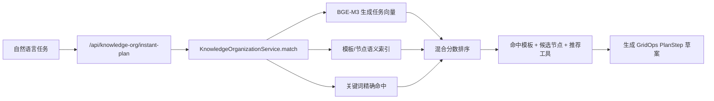
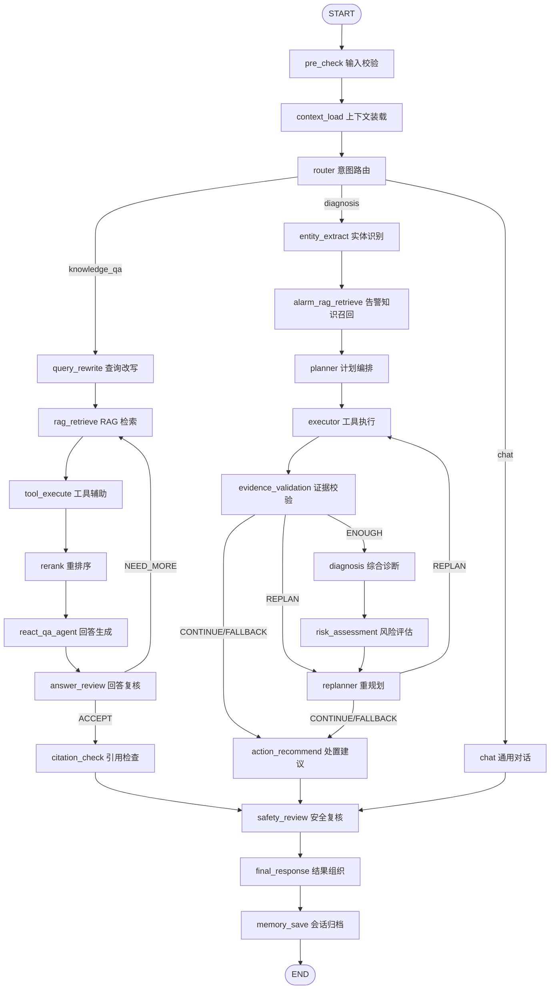
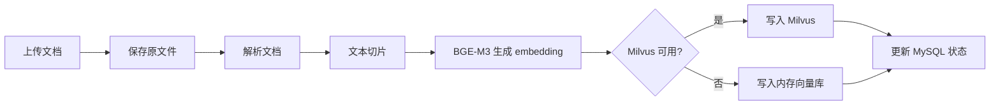
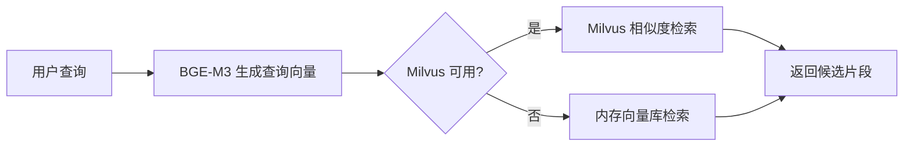
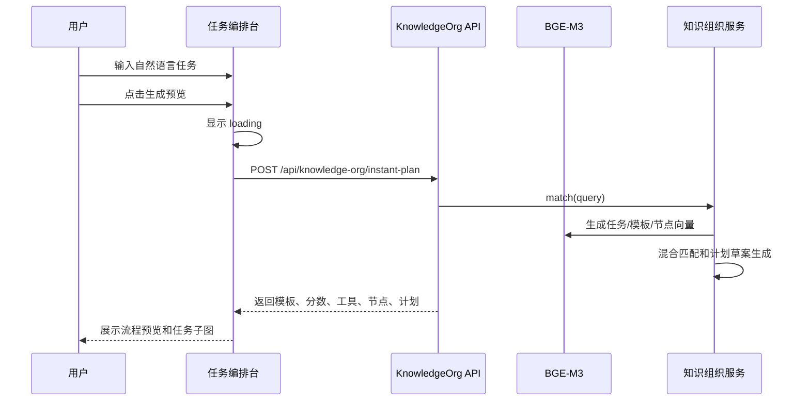
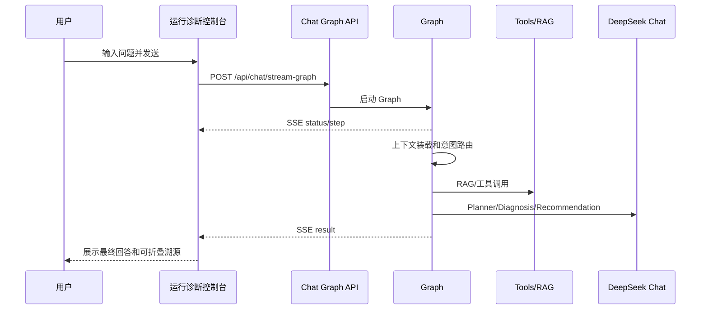
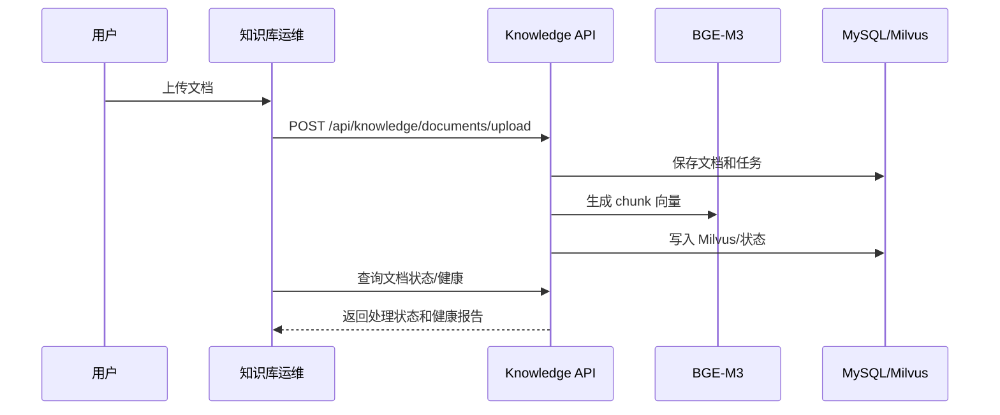

# GridOpsAgent 系统工作流文档

本文整理当前系统已经实现的工作链路，重点覆盖真实人机交互逻辑、前端页面职责、后端 API、Workflow/Skill/Agent 资产层、Graph 编排、RAG 知识库、BGE-M3 语义匹配、知识组织资产和运维健康链路。

## 1. 系统定位

GridOpsAgent 当前由七类能力共同组成：

| 模块 | 主要用途 | 是否执行工具 |
| --- | --- | --- |
| 运行总览 | 汇总 Workflow、Skill、推演算子、典型场景和运行入口 | 不直接执行诊断工具 |
| 流程资产 | 查看、复制、编辑、保存可治理 Workflow | 保存 Workflow 定义 |
| 技能中心 | 查看 Skill、推荐工具、适用场景和流程绑定关系 | 不直接执行诊断工具 |
| 任务编排台 | 将自然语言任务匹配到 Workflow、Skill、目标 Graph、计划步骤和关联图谱 | 不直接执行诊断工具 |
| 运行诊断控制台 | 执行 Graph、多 Agent、工具调用、RAG 检索和诊断总结 | 执行 |
| 知识拓扑 | 浏览流程、工具、知识实体和关系图谱 | 不执行 |
| 知识库运维 | 上传文档、向量化、检索测试、健康检查和一键自检 | 执行 RAG 处理 |

任务编排台和运行诊断控制台共享同一套知识组织资产、Workflow 资产和 Skill 能力，分别承担执行前编排和实际执行：

- 任务编排台负责确认“任务命中哪个 Workflow、需要哪些 Skill、进入哪条 Graph、哪些步骤依赖推演算子”。
- 运行诊断控制台负责真正跑 Agent/Graph 并产生证据、工具返回、最终回答。
- Workflow 步骤同时保存业务 Skill 与底层工具；执行结果携带 Skill 名称、工具名、状态、耗时、结果摘要和失败原因，保证流程资产、任务编排、运行诊断三处口径一致。

## 2. 运行依赖

| 组件 | 端口 | 用途 |
| --- | --- | --- |
| 主应用 `grid-ops-agent-app` | `9900` | Web 页面、API、Graph 编排、RAG、知识组织 |
| MCP 工具服务 `power-tools-mcp-server` | `9901` | 电力设备状态、告警、日志、工单等工具服务 |
| 本地 BGE-M3 Embedding 服务 | `9910` | RAG 向量化、任务模板语义匹配 |
| MySQL | `3307` | 会话、文档、切片、任务、Trace、工具调用日志 |
| Milvus | `19530` | RAG 向量索引 |
| Redis | `6379` | 当前为预留缓存组件，核心链路不强依赖 |

LLM 使用 DeepSeek/OpenAI-compatible chat 接口。RAG embedding 和任务编排台模板语义匹配默认使用本地 BGE-M3，不消耗 DeepSeek token。

## 3. 前端页面工作流

### 3.1 运行总览

用户交互：

1. 用户进入首页，默认打开“运行总览”。
2. 页面读取 `/api/workflow-assets/overview`，展示流程资产、技能能力、推演算子和典型场景。
3. 用户可以从总览跳转到任务编排、运行诊断、流程资产、技能中心、知识拓扑或知识库运维。

### 3.2 流程资产与技能中心

用户交互：

1. 在“流程资产”查看资源种子 Workflow 和用户编辑 Workflow。
2. 点击某个 Workflow 查看步骤、Skill 绑定和 Graph 执行蓝图。
3. 点击“复制为可编辑流程”后，可修改流程名称、场景、风险等级、关键词和步骤 JSON。
4. 保存后写入 `data/workflows/user-workflows.json`，重启后仍可加载。
5. 在“技能中心”查看 Skill 的推荐工具、适用场景、绑定流程数和推演/真实工具边界。

### 3.3 任务编排台

用户交互：

1. 用户输入自然语言任务，例如“500kV 母线检修方式下发生 N-1 故障，生成风险校核流程”。
2. 点击“生成编排”。
3. 页面立即进入 loading：
   - 按钮变为“编排中...”
   - 显示“BGE 语义匹配”
   - 显示“执行条件校验”
4. 前端调用：

```http
POST /api/knowledge-org/instant-plan
POST /api/workflow-assets/match
```

5. 后端返回：
   - 命中 Workflow / 流程模板
   - 混合匹配分
   - 推荐 Skill / 工具能力
   - 候选知识节点
   - 流程草案 `plan_steps`
   - 目标执行图 `execution_graph`
   - 执行条件校验 `execution_precheck`
6. 页面展示：
   - “匹配流程”卡片
   - BGE + 关键词混合匹配分
   - 推荐能力胶囊
   - 目标 Graph、就绪步骤、运行时检索步骤、推演步骤和缺失数据
   - 关联任务子图
   - 候选节点列表和模板详情

后端逻辑：



当前匹配策略：

```text
BGE_M3_SEMANTIC_PLUS_KEYWORD
```

含义：

- BGE-M3 语义相似度为主。
- 电力关键词、模板名称、场景、描述、workflow step 作为精确校验。
- 模板和知识节点向量会在首次匹配时生成并缓存。

边界：

- 编排台会真实调用后端进行语义匹配和计划草案生成。
- 编排台不会执行工具，不产生真实工具耗时、工具返回或诊断证据。
- 执行证据在运行诊断控制台产生。

### 3.2 运行诊断控制台

用户交互：

1. 用户输入问题，例如“主变 TR-110KV-001 油温 86C 超过 80C 阈值，请诊断”。
2. 点击“发送”或“告警诊断”。
3. 页面展示用户消息。
4. 页面创建“执行轨迹”组件。
5. 后端通过 SSE 持续推送：
   - `status`
   - `step`
   - `result`
   - `done`
   - `error`
6. 前端顶部“当前步骤”动态显示：
   - 输入校验
   - 上下文装载
   - 意图路由
   - 计划编排
   - 工具执行
   - 证据校验
   - 综合诊断
   - 安全复核
   - 结果组织
7. 执行过程默认折叠，用户可手动展开每一步溯源。
8. 最终回答显示在同一条 assistant 消息中。

对话入口：

```http
POST /api/chat/stream-graph
```

告警诊断入口：

```http
POST /api/alarm/diagnose
```

前端展示原则：

- 用户默认看到业务化阶段，不直接暴露英文工具名。
- 英文工具名和原始返回保留在折叠详情中。
- `result` 和 `done` 事件只完成一次，避免重复“已完成”。

### 3.3 知识拓扑

用户交互：

1. 用户进入“知识拓扑”。
2. 页面调用：

```http
GET /api/knowledge-org/graph
```

3. 用户可：
   - 搜索节点
   - 切换图谱视图模式
   - 鼠标滚轮缩放
   - 拖拽平移
   - 点击节点查看详情

后端资源：

- `workflow_templates.json`
- `nodes.json`
- `edges.json`
- `schema.json`

用途：

- 展示 nari 迁移的流程模板、工具节点、知识实体和关系。
- 辅助理解任务编排台和 Planner 使用的知识组织层。

### 3.4 知识库运维

用户交互：

1. 用户进入“知识库运维”。
2. 页面加载 RAG 健康面板：

```http
GET /api/knowledge/health
```

3. 用户可上传文档：

```http
POST /api/knowledge/documents/upload
```

4. 系统异步处理：
   - 保存原文件
   - 文档解析
   - 文档切片
   - BGE-M3 embedding
   - 写入 Milvus 或内存向量库
   - 更新 MySQL 状态
5. 用户可查看文档状态：

```http
GET /api/knowledge/documents/{documentId}/status
```

6. 用户可执行检索测试：

```http
POST /api/knowledge/search/test
```

7. 用户可执行一键自检：

```http
POST /api/knowledge/self-test
```

自检结果展示为精简摘要：

- 文档状态
- 切片数
- 向量数
- 检索是否命中
- 召回数
- 耗时
- 临时数据清理状态

## 4. Graph 主工作流

Graph 入口统一从 `PowerOpsGraphConfig` 构建。主干如下：



## 5. 关键节点说明

### 5.1 PreCheckNode

职责：

- 清洗输入。
- 做长度限制和基础安全检查。
- 输出 `cleaned_input`。

### 5.2 ContextLoadNode

职责：

- 加载会话记忆。
- 根据 intent 加载 Skill prompt。
- 调用 `KnowledgeOrganizationService.buildWorkflowContext(input)`。
- 将 nari 迁移资产匹配结果写入：

```text
workflow_context
```

说明：

运行诊断控制台会自动使用知识组织资产、Workflow 资产和 Skill 能力。它不依赖用户先在任务编排台点击预览，而是根据当前输入重新匹配流程、技能和节点。

### 5.3 RouterNode

职责：

- 判断意图：
  - `knowledge_qa`
  - `diagnosis`
  - `chat`
- 分派到不同子图。

### 5.4 PlannerNode

职责：

- 读取：
  - 用户输入
  - RAG 上下文
  - Skill 上下文
  - workflow_context
  - 实体信息
- 调用 LLM 生成结构化 `plan_steps`。
- 通过 `PlanValidator` 规范化。

输出：

```text
plan_steps
```

### 5.5 PlanValidator

职责：

- 修正工具别名。
- 限制最大步骤数。
- 将 nari 工具名映射为 GridOps 工具名。
- 对截断或近似工具名做修正。
- 按步骤号排序并重新编号。

示例映射：

| nari/别名 | GridOps 工具 |
| --- | --- |
| `regulation_retriever` | `searchSafetyRules` |
| `source_scanner` / `bge_rag` / `plan_retriever` | `queryInternalDocs` |
| `graph_query` | `queryKnowledgeGraph` |
| `topology_analyzer` | `analyzeTopology` |
| `operator_fault_scenario_generation` | `generateFaultScenario` |
| `queryMaintenanceSchedule` | `queryInternalDocs` |

### 5.6 ExecutorNode

职责：

- 按计划执行工具。
- 跳过已完成、已跳过或已失败的旧步骤。
- 记录工具调用日志。
- 将工具返回转成业务摘要。
- 累计 `step_results`。
- 对每个工具结果写入 `businessSkillId` / `businessSkillName`，前端和最终报告优先显示中文业务能力名称。
- 输出 evidence。

工具执行结果不会直接暴露给最终回答，而是作为诊断证据。

主变油温异常主线会执行 `assessTransformerOilTempRisk`。该步骤由 Workflow 中的“主变油温规则校核”Skill 触发，输出油温裕度、负荷率、冷却器状态、风险等级和人工确认项；结果用于诊断报告引用，但不代表真实 SCADA/EMS 控制结论。

### 5.7 EvidenceValidationNode

职责：

- 评估证据覆盖度和质量。
- 判断下一步：
  - 进入诊断
  - 进入重规划
  - 直接生成处置建议

### 5.8 DiagnosisNode

职责：

- 生成结构化诊断报告。
- 要求不复述 raw tool logs、JSON 或 Markdown step blocks。

### 5.9 ActionRecommendNode

职责：

- 如果已有诊断报告，则补充行动建议。
- 如果缺少高质量诊断文本，则使用 LLM fallback prompt 基于：
  - 用户原始问题
  - 计划步骤
  - 工具执行摘要
  - 证据摘要
  - 风险等级
  生成兜底诊断/流程建议。

注意：

- 当前已取消固定 Java 场景兜底。
- fallback 不再硬编码“主变”或“500kV 母线 N-1”。

### 5.10 SafetyReviewNode

职责：

- 执行安全复核 hook。
- 对高风险操作追加安全提示。

### 5.11 FinalResponseNode

职责：

- 组织最终回答。
- 追加简要执行概况。
- 不逐条展开工具结果。

### 5.12 MemorySaveNode

职责：

- 保存会话上下文。
- 支持历史会话加载。

## 6. RAG 工作流

### 6.1 上传与索引



状态：

- `COMPLETED`
- `PARTIAL_COMPLETED`
- `FAILED`

如果 Milvus 不可用：

- 页面会提示当前使用内存向量库。
- 重启后内存向量会丢失。

### 6.2 查询检索



`queryInternalDocs` 会过滤 RAG 自检文档，避免临时测试文本污染正式诊断。

## 7. BGE-M3 使用位置

当前 BGE-M3 有两个主要用途：

| 场景 | 是否使用 BGE-M3 | 说明 |
| --- | --- | --- |
| RAG 文档上传 | 是 | 为 chunk 生成向量 |
| RAG 查询 | 是 | 为 query 生成向量 |
| 任务编排台模板匹配 | 是 | 为任务、模板、节点生成向量，计算语义相似度 |
| Graph Chat/Diagnosis LLM 回答 | 否 | 使用 DeepSeek chat |

BGE-M3 服务：

```text
http://127.0.0.1:9910
```

模型名：

```text
bge-m3
```

维度：

```text
1024
```

## 8. nari 知识组织资产链路

迁移资源位置：

```text
grid-ops-agent-app/src/main/resources/knowledge-organization/
```

包含：

- `workflow_templates.json`
- `nodes.json`
- `edges.json`
- `schema.json`

使用位置：

| 链路 | 使用方式 |
| --- | --- |
| 任务编排台 | 模板匹配、推荐工具、候选节点、计划草案 |
| 知识拓扑 | 图谱浏览、节点详情、任务子图 |
| 运行诊断控制台 | ContextLoadNode 注入 workflow_context / workflow_asset_context，Planner 参考 |
| 工具调用 | `queryKnowledgeGraph` 查询迁入图谱资源 |
| 拓扑/风险算子 | `analyzeTopology`、`checkOperationRisk`、`generateFaultScenario` 参考图谱和模板 |

## 9. 人机交互链路总览

### 9.1 用户做流程预演



### 9.2 用户做协同诊断



### 9.3 用户做知识库运维



## 10. API 清单

### Chat / Graph

| API | 用途 |
| --- | --- |
| `POST /api/chat` | 同步对话 |
| `POST /api/chat/stream` | 普通 SSE 对话 |
| `POST /api/chat/stream-graph` | Graph 流式诊断/问答 |
| `GET /api/chat/history` | 会话历史 |
| `GET /api/chat/sessions` | 会话列表 |
| `POST /api/chat/clear` | 清空会话 |

### Alarm

| API | 用途 |
| --- | --- |
| `POST /api/alarm/receive` | 接收告警 |
| `POST /api/alarm/diagnose` | 启动告警诊断 SSE |
| `GET /api/alarm/diagnose/{taskId}/status` | 查看诊断任务状态 |
| `POST /api/alarm/resume/{taskId}` | 恢复诊断任务 |
| `GET /api/alarm/checkpoint/{taskId}` | 查看 checkpoint |

### Knowledge Organization

| API | 用途 |
| --- | --- |
| `GET /api/knowledge-org/overview` | 知识组织概览 |
| `GET /api/knowledge-org/templates` | 模板列表 |
| `GET /api/knowledge-org/graph` | 图谱节点/边 |
| `POST /api/knowledge-org/match` | 模板匹配 |
| `POST /api/knowledge-org/instant-plan` | 即时流程草案 |

### Workflow / Skill Assets

| API | 用途 |
| --- | --- |
| `GET /api/workflow-assets/overview` | Workflow / Skill 资产概览 |
| `GET /api/workflow-assets/workflows` | 流程资产列表 |
| `GET /api/workflow-assets/workflows/{workflowId}` | 流程详情 |
| `POST /api/workflow-assets/workflows` | 新建可编辑 Workflow |
| `PUT /api/workflow-assets/workflows/{workflowId}` | 更新 Workflow |
| `DELETE /api/workflow-assets/workflows/{workflowId}` | 删除用户编辑 Workflow |
| `POST /api/workflow-assets/match` | 自然语言任务匹配 Workflow 与 Skill |
| `GET /api/workflow-assets/skills` | Skill 能力中心 |
| `GET /api/workflow-assets/workflows/{workflowId}/blueprint` | Workflow 执行蓝图 |

### Knowledge / RAG

| API | 用途 |
| --- | --- |
| `POST /api/knowledge/documents/upload` | 上传并索引文档 |
| `GET /api/knowledge/documents` | 文档列表 |
| `GET /api/knowledge/documents/{documentId}/status` | 文档处理状态 |
| `DELETE /api/knowledge/documents/{documentId}` | 删除文档 |
| `POST /api/knowledge/search/test` | 检索测试 |
| `GET /api/knowledge/health` | RAG 健康面板 |
| `POST /api/knowledge/self-test` | 一键 RAG 自检 |

### Tools / Skills / Observability

| API | 用途 |
| --- | --- |
| `GET /api/tools/list` | 工具列表 |
| `GET /api/tools/search` | 工具搜索 |
| `GET /api/tools/high-risk` | 高风险工具 |
| `GET /api/skills` | Skill 列表 |
| `POST /api/skills/select` | Skill 选择 |
| `GET /api/observability/traces/{traceId}` | Trace 查询 |

## 11. 当前边界

| 能力 | 当前状态 |
| --- | --- |
| RAG 上传、切片、向量化、检索 | 已实现 |
| BGE-M3 本地 embedding | 已实现 |
| 任务模板语义匹配 | 已实现，BGE + 关键词混合 |
| nari 模板/图谱迁移 | 已实现为 classpath 资源 |
| 协同诊断读取 nari 资产 | 已实现，通过 `workflow_context` 注入 Planner |
| 编排台选择结果直接传入诊断 | 暂未实现 |
| 潮流/稳定/风险高阶算子 | 当前为 mock/estimate |
| Redis 缓存 | 预留，核心链路不强依赖 |
| 真实 EMS/DTS/SCADA 接入 | 暂未接入 |

## 12. 建议后续演进

1. 强化任务编排台和运行诊断控制台的显式上下文传递：
   - 编排台选择 Workflow 后，可将 `workflow_id`、候选节点和计划草案传入 Graph 初始状态。
   - `ContextLoadNode` 已写入 `workflow_asset_context`，后续可进一步支持用户手动锁定流程版本。

2. 强化 trace 的业务化表达：
   - 后端直接输出中文 `display_name`、`display_summary`。
   - 前端不再承担过多工具名翻译逻辑。

3. 优化 LLM 最终报告质量：
   - 为油温、N-1、负荷转供、全停故障等场景建立报告模板。
   - 报告只展示结论和建议，工具调用细节留在溯源。

4. 持久化知识组织资产：
   - 当前模板和图谱是 resources JSON。
   - 后续可迁移到 MySQL 表，支持在线编辑和版本管理。

5. 接入真实业务数据：
   - EMS/DTS 潮流
   - SCADA 实时测点
   - 检修计划
   - 保护配置
   - 工单和缺陷系统
